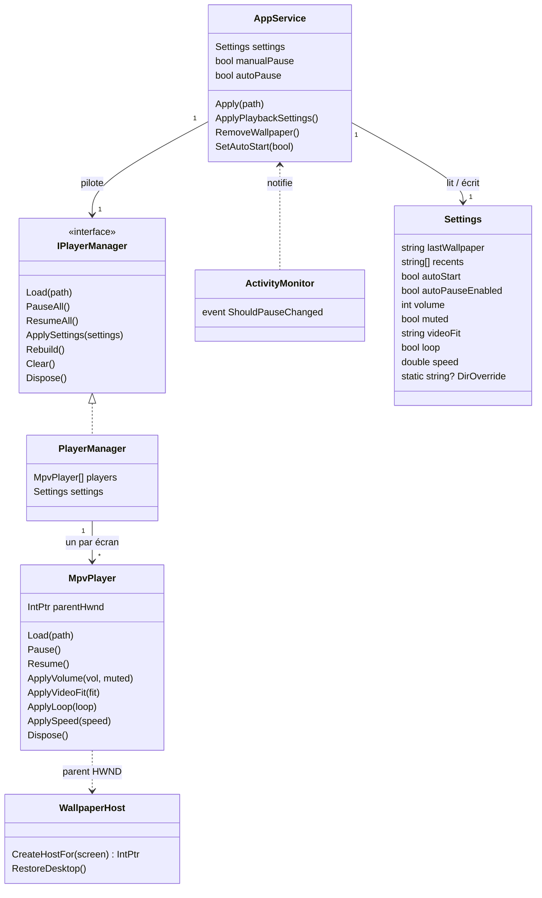
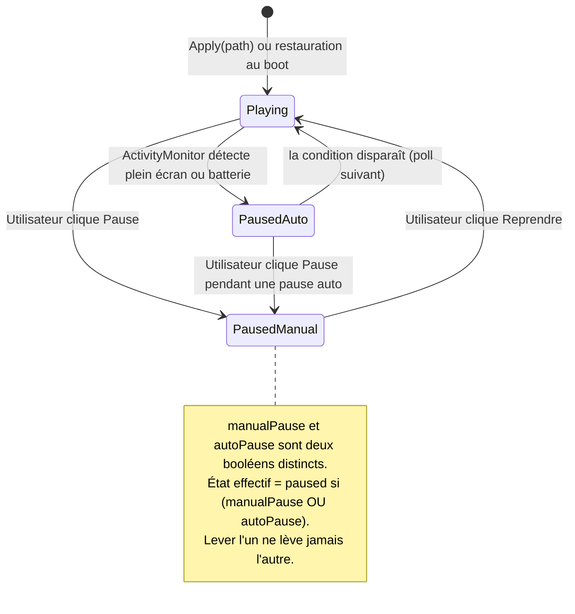
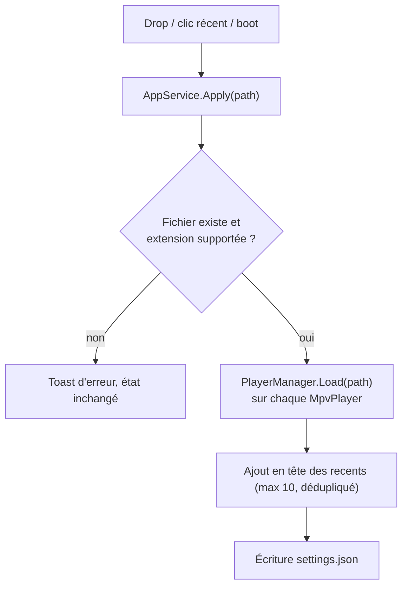
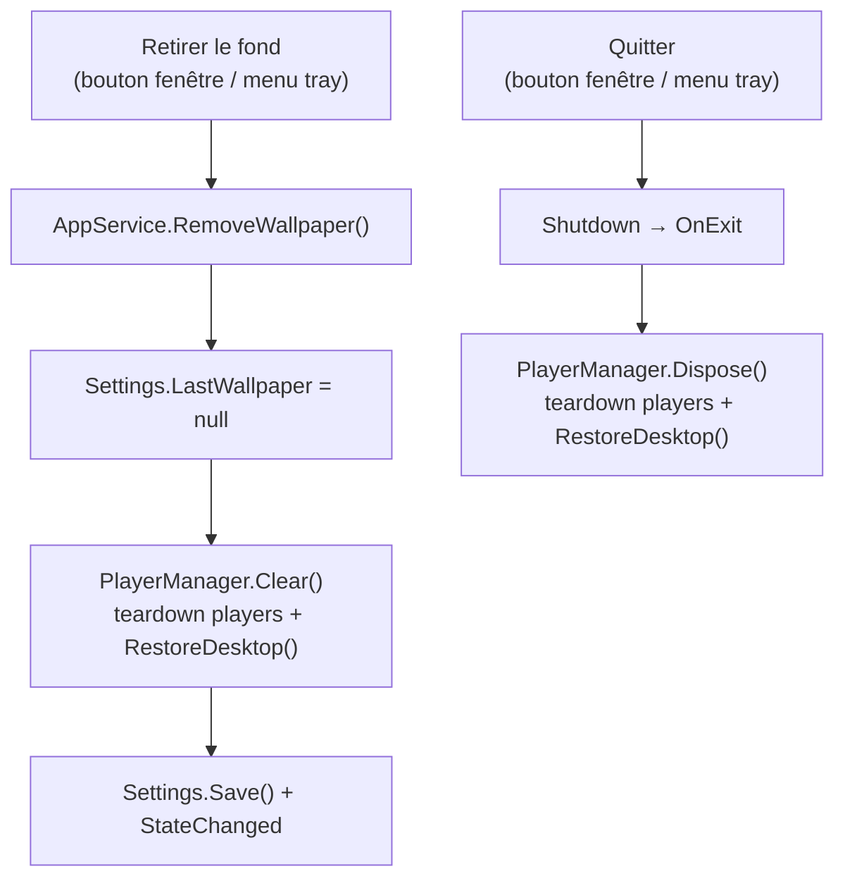
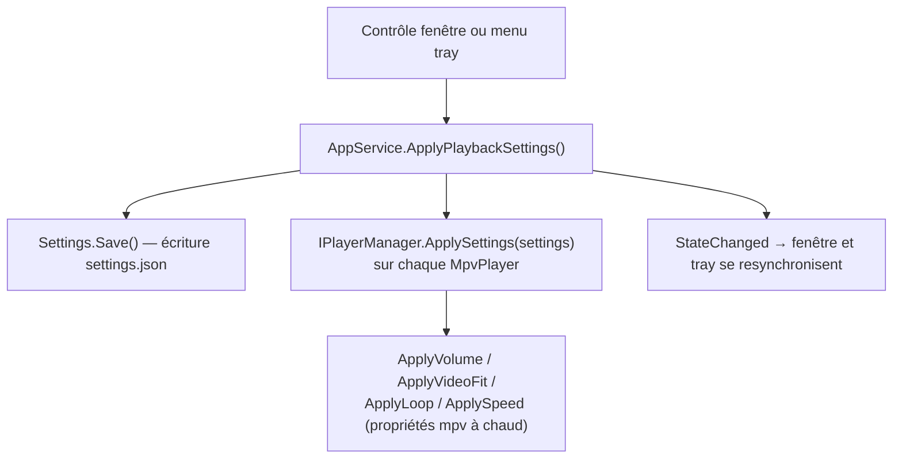

# Architecture technique — annexe

> **Niveau 2 / 2** — Annexe technique, destinée à un lecteur semi-technique (revue, futur développeur).
> Vue produit : [VUE-PRODUIT.md](./VUE-PRODUIT.md) · Glossaire : [../CONTEXT.md](../CONTEXT.md) ·
> Décisions produit : [../DESIGN.md](../DESIGN.md).
> Les diagrammes ci-dessous sont en **Mermaid** : ils s'affichent directement sur GitHub.
> _Généré au commit `e1fcec3` (2026-07-18)._
<!-- doc-provenance: commit=e1fcec3 generated=2026-07-18 -->

## Stack

| Couche | Technologie | Emplacement |
|--------|-------------|-------------|
| Application | C# / .NET 8 WPF, TFM `net8.0-windows10.0.19041.0` (min. 17763), x64 | `src/Wallflow/` |
| Lecture média | libmpv (`libmpv-2.dll`, build shinchiro, dans `lib/` hors git), embedding `wid` | `MpvPlayer.cs` |
| Intégration bureau | WinAPI via P/Invoke (WorkerW, foreground, power) | `WallpaperHost.cs`, `ActivityMonitor.cs` |
| UI tray | H.NotifyIcon.Wpf 2.3.0 (icône via `Icon.ExtractAssociatedIcon`, efficiency mode off) | `App.xaml.cs` (`BuildTray`) |
| Thème | WPF-UI 4.3.0 (FluentWindow, Mica, thème sombre) | `MainWindow.xaml` |
| Vignettes | API shell `IShellItemImageFactory` | `Thumbnail.cs` |
| Persistance | `System.Text.Json`, fichier unique | `%LOCALAPPDATA%\Wallflow\settings.json` |
| Tests | xunit, mock manuel de `IPlayerManager`, `Settings.DirOverride` pour isoler le `settings.json` réel | `tests/Wallflow.Tests/` |

Formats acceptés (`AppService.SupportedExtensions`) : `.gif .webp .mp4 .webm .mkv .png .jpg .jpeg .bmp`
— `.mkv` s'est ajouté au design initial (gratuit via mpv).

Cibles : Windows 10/11, x64 uniquement. Distribution : zip portable (pas d'installeur).

## Modèle de domaine (non persisté, sauf `Settings`)

Pas de base de données. Le domaine est un graphe d'objets en mémoire ; seul `Settings` est
sérialisé sur disque.



Frontières (décision figée) : tout le WinAPI est confiné dans `WallpaperHost` + `ActivityMonitor`,
tout libmpv dans `MpvPlayer`. `AppService` et `PlayerManager` sont du .NET pur, testables sans
écran. Un seul seam de DI : `AppService` reçoit un `IPlayerManager` (interface extraite pour les
tests, mock dans `tests/Wallflow.Tests/`) ; le reste est instancié en concret.

## Cycle de vie de la lecture

L'état de lecture est le produit de **deux drapeaux indépendants** (`manualPause`, `autoPause`) —
la lecture ne tourne que si les deux sont levés. C'est le point de design le plus piégeux : la fin
d'un jeu plein écran lève `autoPause` mais ne doit jamais lever une pause manuelle posée avant.



## Flux métier

### Appliquer un wallpaper

Déclencheurs : drop dans `MainWindow`, clic sur un élément des `Récents`, ou restauration au boot.



La validation d'entrée (existence du fichier, extension dans la liste supportée) est la seule
frontière de confiance du produit : tout le reste est local et mono-utilisateur.

### Retirer le fond d'écran / Quitter (Restauration du bureau)

Détruire les fenêtres hôtes ne fait **pas** réapparaître le fond natif : Windows laisse le bureau
blanc. La primitive `WallpaperHost.RestoreDesktop()` corrige ça —
`SystemParametersInfo(SPI_SETDESKWALLPAPER, 0, null, SPIF_UPDATEINIFILE | SPIF_SENDCHANGE)` demande
au shell de repeindre le fond enregistré.



État « retiré » = **absence de wallpaper courant**, exprimée par `LastWallpaper == null` (décision B :
aucun drapeau dédié). Le garde de démarrage existant (`si LastWallpaper existe & fichier présent →
Apply`) rend la persistance gratuite : après un retrait, rien n'est réappliqué au boot suivant.
`Rebuild()` (écran branché/débranché) ne restaure **pas** — il re-couvre immédiatement, éviter le
flicker.

### Démarrage (clé `Run`)

1. Windows lance `wallflow.exe` (clé `HKCU\...\Run`, écrite par l'app elle-même).
2. Mutex nommé single-instance : une deuxième instance active la fenêtre de la première et quitte.
3. L'app **réécrit sa clé `Run` avec son chemin courant à chaque lancement** — c'est ce qui rend le
   zip portable déplaçable sans casser l'auto-start (décision DESIGN.md).
4. Démarrage dans le tray, sans fenêtre ; si `lastWallpaper` existe encore sur disque → `Apply`.

### Appliquer un réglage de lecture

Déclencheurs : un contrôle de la section réglages de `MainWindow` (slider volume avec readout `%`,
toggle muet, radios cadrage, toggle boucle, **4 radios de vitesse** `0.5× · 1× · 1.5× · 2×`) ou le
sous-menu Volume du tray (`App.BuildTray` : muet + presets 25/50/75/100 %).

La vitesse s'affiche par **paliers nommés** (helper pur `SpeedPaliers`, valeurs `[0.5, 1.0, 1.5,
2.0]`). Au refresh, la fenêtre met en évidence `SpeedPaliers.Nearest(Settings.Speed)` **sans**
réécrire `Settings.Speed` tant que l'Utilisateur ne clique pas (garde `_refreshing`) — une valeur
enregistrée hors palier (ex. `3.0`) n'est pas silencieusement écrasée. Le backend `Settings.Speed`
reste continu (clamp `0.25–4.0`) : seul l'affichage se restreint aux paliers.



`PlayerManager` mémorise les derniers `Settings` reçus et les **réapplique à chaque `Load`** :
les players fraîchement créés (démarrage, `Rebuild`) partent des défauts figés du constructeur
`MpvPlayer`, pas de `settings.json`. `AppService` pousse les settings au manager dès sa
construction. Les valeurs hors limites sont clampées dans les setters de `Settings`
(volume 0-100, vitesse 0.25-4.0, cadrage restreint à cover/fit/fill).

### Reconstruction multi-écran

`SystemEvents.DisplaySettingsChanged` → `PlayerManager.Rebuild()` : dispose tous les
`MpvPlayer`, ré-énumère les écrans, recrée un player par écran, ré-applique le wallpaper courant
et les réglages de lecture. Brutal mais simple ; un changement d'écran est un événement rare.

## Intégration bureau (WorkerW)

Le point non standard du projet. `WallpaperHost` envoie `SendMessage(Progman, 0x052C)` pour que le
shell crée la fenêtre WorkerW entre le fond d'écran natif et les icônes, puis y insère une fenêtre
enfant par écran, dimensionnée aux bounds du monitor. Chaque `MpvPlayer` reçoit ce HWND via
l'option mpv `wid` (mpv rend directement dedans — pas de render API, pas d'OpenGL côté app).

> ⚠️ Technique non documentée par Microsoft : peut casser sur une mise à jour de Windows.
> Référence d'implémentation : le code source de Lively Wallpaper.

Options mpv posées au constructeur (défauts sûrs, écrasés ensuite par `ApplySettings`) :
`loop-file=inf`, `mute=yes`, `panscan=1.0` (cover), `hwdec=auto`. Deux subtilités relevées en
code-review : mpv n'a **pas** de propriété `video-fit` — le cadrage se pilote via
`panscan` + `keepaspect` (cover = panscan 1 ; fit = panscan 0 ; fill = keepaspect no) — et la
vitesse est formatée en `CultureInfo.InvariantCulture` (en fr-FR, `1,50` serait rejeté par mpv).

## Surveillance d'activité

| Tâche | Déclencheur | Planning | Effet |
|-------|-------------|----------|-------|
| Détection plein écran | `DispatcherTimer` dans `ActivityMonitor` | toutes les 2 s | `GetForegroundWindow` + comparaison de ses bounds à ceux du monitor → `autoPause` |
| Détection batterie | même timer | toutes les 2 s | `PowerLineStatus` / économie d'énergie → `autoPause` |

Polling assumé (`ponytail`) : des hooks WinEvent remplaceront le timer si le poll devient visible
en consommation, ce qui est improbable à 0,5 Hz.

## Persistance

Un seul fichier, `%LOCALAPPDATA%\Wallflow\settings.json`, réécrit en entier à chaque changement :

```json
{
  "LastWallpaper": "C:\\Users\\...\\ocean.mp4",
  "Recents": ["...max 10 chemins, plus récent en tête..."],
  "AutoStart": true,
  "AutoPauseEnabled": true,
  "Volume": 100,
  "Muted": false,
  "VideoFit": "cover",
  "Loop": true,
  "Speed": 1.0
}
```

Pas à côté de l'exe : le dossier portable peut être déplacé ou en lecture seule — LOCALAPPDATA
survit aux deux. Les `recents` stockent des **chemins**, pas des copies : un fichier supprimé par
l'utilisateur disparaît de la grille (`AppService.Recents` filtre sur `File.Exists`), mais
**n'est jamais purgé du JSON** — écart réel vs intention, relevé en code-review, à corriger ou assumer.

## Vignettes des récents

Aucun code de génération : l'API shell Windows (`IShellItemImageFactory`) fournit des miniatures
pour tous les formats supportés (c'est elle que l'Explorateur utilise). Appel par chemin, cache
géré par l'OS.

## Intégrations externes

| Dépendance | Usage | Nature |
|-----------|-------|--------|
| libmpv (`mpv-2.dll`) | décodage + rendu de tous les formats | binaire natif embarqué (~50-70 Mo, poids assumé) |
| H.NotifyIcon | icône et menu de la zone de notification | package NuGet |
| WPF-UI (ou équivalent) | thème Fluent sombre | package NuGet |

Aucun service réseau : pas de télémétrie, pas de mise à jour automatique, rien ne sort de la machine.
