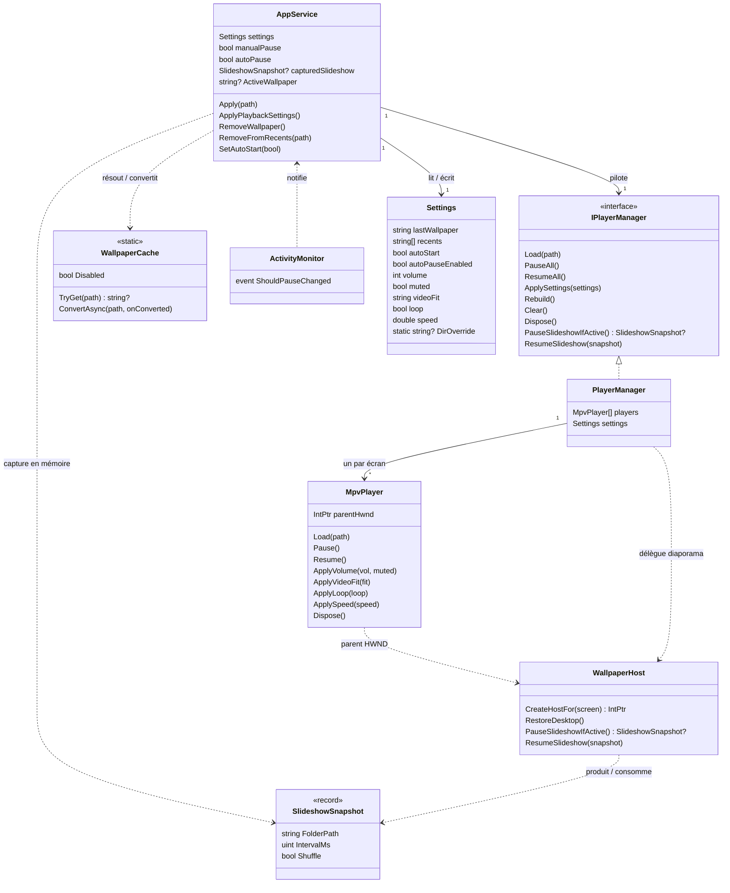
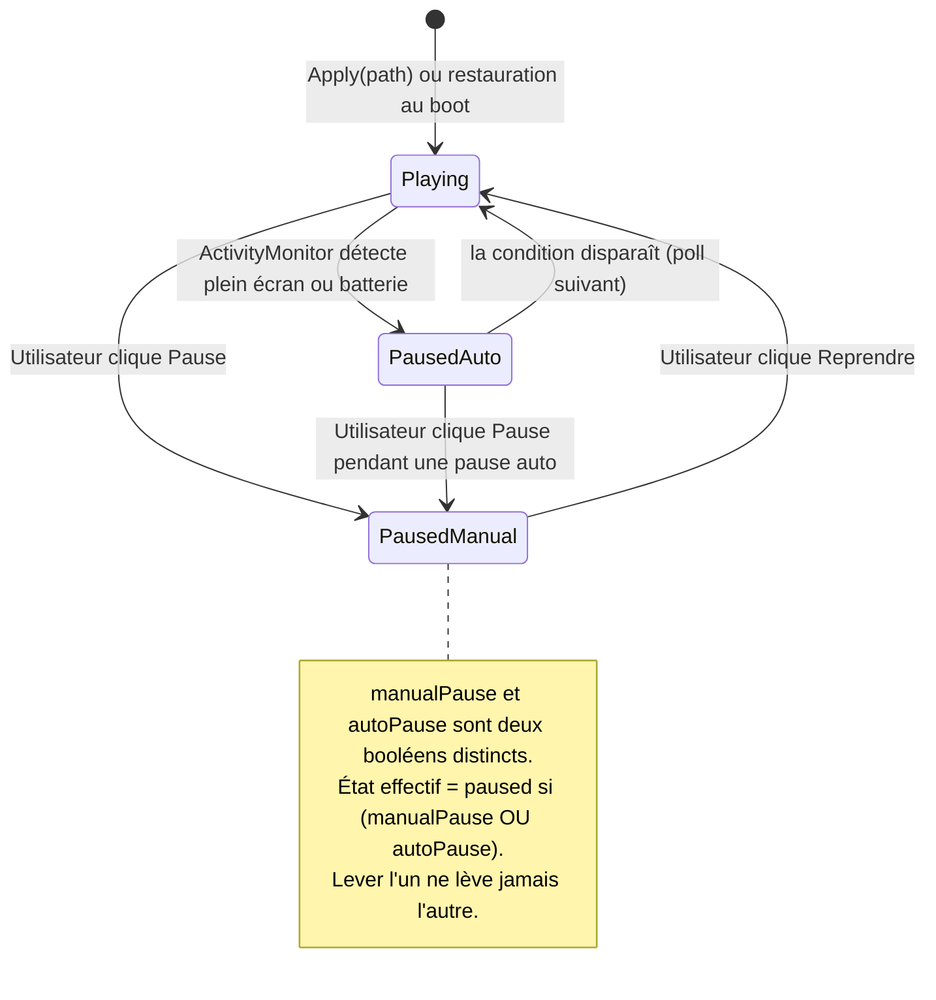
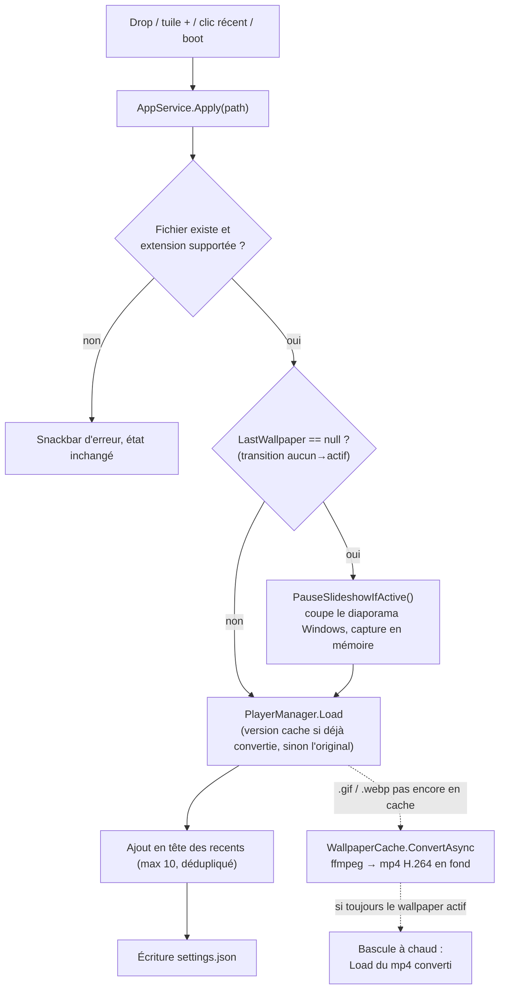
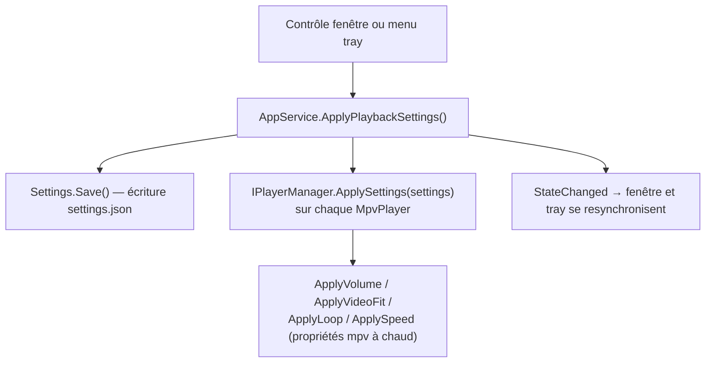

# Architecture technique — annexe

> **Niveau 2 / 2** — Annexe technique, destinée à un lecteur semi-technique (revue, futur développeur).
> Vue produit : [VUE-PRODUIT.md](./VUE-PRODUIT.md) · Glossaire : [../CONTEXT.md](../CONTEXT.md) ·
> Décisions produit : [../DESIGN.md](../DESIGN.md).
> Les diagrammes ci-dessous sont en **Mermaid** : ils s'affichent directement sur GitHub.
> _Généré au commit `4ec958b` (2026-07-19)._
<!-- doc-provenance: commit=4ec958b generated=2026-07-19 -->

## Stack

| Couche | Technologie | Emplacement |
|--------|-------------|-------------|
| Application | C# / .NET 8 WPF, TFM `net8.0-windows10.0.19041.0` (min. 17763), x64 | `src/Wallflow/` |
| Lecture média | libmpv (`libmpv-2.dll`, build shinchiro, dans `lib/` hors git), embedding `wid` | `MpvPlayer.cs` |
| Intégration bureau | WinAPI via P/Invoke (WorkerW, foreground, power) | `WallpaperHost.cs`, `ActivityMonitor.cs` |
| UI tray | H.NotifyIcon.Wpf 2.3.0 (icône via `Icon.ExtractAssociatedIcon`, efficiency mode off) | `App.xaml.cs` (`BuildTray`) |
| Fenêtre | WPF-UI 4.3.0 : `FluentWindow` backdrop Mica + accent système, redimensionnable ; grille des `Récents` en héros, barre du bas à 3 contrôles (`Flyout` volume / réglages), `SnackbarPresenter` pour les erreurs, icônes `SymbolIcon` (Segoe Fluent) | `MainWindow.xaml(.cs)` |
| Vignettes | API shell `IShellItemImageFactory`, décodage **asynchrone** (thread pool + Dispatcher) | `Thumbnail.cs`, `MainWindow.BuildThumb` |
| Conversion perf | ffmpeg.exe embarqué (build ≥ 7.1 requis pour le webp animé, `lib/` hors git comme libmpv) : GIF/webp → mp4 H.264 en cache pour récupérer le décodage matériel | `WallpaperCache.cs` |
| Persistance | `System.Text.Json`, fichier unique | `%LOCALAPPDATA%\Wallflow\settings.json` |
| Tests | xunit, mock manuel de `IPlayerManager` ; isolation du réel : `Settings.DirOverride` (settings.json), `AppService.SkipRunKey` (clé registre `Run`), `WallpaperCache.Disabled` (pas de spawn ffmpeg) | `tests/Wallflow.Tests/` |

Formats acceptés (`AppService.SupportedExtensions`) : `.gif .webp .mp4 .webm .mkv .png .jpg .jpeg .bmp`
— `.mkv` s'est ajouté au design initial (gratuit via mpv).

Cibles : Windows 10/11, x64 uniquement. Distribution : zip portable (pas d'installeur).

## Modèle de domaine (non persisté, sauf `Settings`)

Pas de base de données. Le domaine est un graphe d'objets en mémoire ; seul `Settings` est
sérialisé sur disque.



Frontières (décision figée) : tout le WinAPI **et le COM `IDesktopWallpaper`** (diaporama natif) sont
confinés dans `WallpaperHost` + `ActivityMonitor`, tout libmpv dans `MpvPlayer`. `AppService` et
`PlayerManager` sont du .NET pur, testables sans écran — l'orchestration du diaporama vit dans
`AppService` (transitions), pas dans le code COM ; `PlayerManager` ne fait que déléguer à
`WallpaperHost`. Un seul seam de DI : `AppService` reçoit un `IPlayerManager` (interface extraite pour les
tests, mock dans `tests/Wallflow.Tests/`) ; le reste est instancié en concret.

## Cycle de vie de la lecture

L'état de lecture est le produit de **deux drapeaux indépendants** (`manualPause`, `autoPause`) —
la lecture ne tourne que si les deux sont levés. C'est le point de design le plus piégeux : la fin
d'un jeu plein écran lève `autoPause` mais ne doit jamais lever une pause manuelle posée avant.



## Flux métier

### Appliquer un wallpaper

Déclencheurs : drop n'importe où sur `MainWindow` (voile plein cadre pendant le glisser), tuile
« + » ou dialogue Parcourir, clic sur un élément des `Récents`, ou restauration au boot.



La conversion (`WallpaperCache`, clé de cache = chemin + taille + date dans
`%LOCALAPPDATA%\Wallflow\cache`) existe pour la perf : le décodage GIF/webp de mpv est 100 % CPU
(webp 17 Mo mesuré à 27,5 % sur la machine de référence), le mp4 converti se décode en matériel
(~1 % à cache chaud). L'original joue pendant la conversion (~20-30 s) ; les `recents` et
`settings.json` gardent toujours le **chemin d'origine**. Sans `ffmpeg.exe` ou sur échec ffmpeg,
l'original joue tel quel — le cache est une optimisation, jamais un point de défaillance. Le test
« toujours actif » se fait dans le lambda dispatché sur le thread UI (un Apply intercalé ne doit
pas être écrasé par une conversion périmée). Pas d'éviction du cache (borné de fait par les
10 récents).

La validation d'entrée (existence du fichier, extension dans la liste supportée) est la seule
frontière de confiance du produit : tout le reste est local et mono-utilisateur.

### Retirer le fond d'écran / Quitter (Restauration du bureau)

Détruire les fenêtres hôtes ne fait **pas** réapparaître le fond natif : Windows laisse le bureau
blanc. La primitive `WallpaperHost.RestoreDesktop()` corrige ça —
`SystemParametersInfo(SPI_SETDESKWALLPAPER, 0, null, SPIF_UPDATEINIFILE | SPIF_SENDCHANGE)` demande
au shell de repeindre le fond enregistré.


État « retiré » = **absence de wallpaper courant**, exprimée par `LastWallpaper == null` (décision B :
aucun drapeau dédié). Le garde de démarrage existant (`si LastWallpaper existe & fichier présent →
Apply`) rend la persistance gratuite : après un retrait, rien n'est réappliqué au boot suivant.
`Rebuild()` (écran branché/débranché) ne restaure **pas** — il re-couvre immédiatement, éviter le
flicker.

### Retirer des récents / marquage du wallpaper actif

Deux ajouts au cœur, confinés à `AppService`, sans nouvel état :

- `ActiveWallpaper` est une **propriété dérivée** (`=> Settings.LastWallpaper`) : la grille marque
  d'un badge la vignette dont le chemin correspond (comparaison `OrdinalIgnoreCase`). Elle devient
  `null` après `RemoveWallpaper`.
- `RemoveFromRecents(path)` ôte l'entrée de `Settings.Recents`, sauvegarde et notifie `StateChanged`.
  Elle **ne touche ni les players ni le wallpaper courant** — retirer la vignette de l'actif ne
  déclenche donc jamais un `RemoveWallpaper` : le fond continue de jouer, il n'est plus dans la
  grille. C'est le comportement couvert par `AppServiceTests` (retrait + persistance + notification +
  non-interférence).

Le menu contextuel des vignettes (`MainWindow.BuildRecentMenu`) expose « Retirer des récents » et
« Ouvrir l'emplacement du fichier » (`explorer /select`) ; la tuile « + » n'a pas de menu.

### Démarrage (clé `Run`)

1. Windows lance `wallflow.exe` (clé `HKCU\...\Run`, écrite par l'app elle-même).
2. Mutex nommé single-instance : une deuxième instance active la fenêtre de la première et quitte.
3. L'app **réécrit sa clé `Run` avec son chemin courant à chaque lancement** — c'est ce qui rend le
   zip portable déplaçable sans casser l'auto-start (décision DESIGN.md).
4. Démarrage dans le tray, sans fenêtre ; si `lastWallpaper` existe encore sur disque → `Apply`.

### Appliquer un réglage de lecture

Déclencheurs : un contrôle des flyouts de la barre du bas de `MainWindow` (flyout volume : slider
avec readout `%` + toggle muet ; flyout ⚙ : radios cadrage, toggle boucle, **4 radios de vitesse**
`0.5× · 1× · 1.5× · 2×`, toggle démarrage Windows) ou le sous-menu Volume du tray (`App.BuildTray` :
muet + presets 25/50/75/100 %).

La vitesse s'affiche par **paliers nommés** (helper pur `SpeedPaliers`, valeurs `[0.5, 1.0, 1.5,
2.0]`). Au refresh, la fenêtre met en évidence `SpeedPaliers.Nearest(Settings.Speed)` **sans**
réécrire `Settings.Speed` tant que l'Utilisateur ne clique pas (garde `_refreshing`) — une valeur
enregistrée hors palier (ex. `3.0`) n'est pas silencieusement écrasée. Le backend `Settings.Speed`
reste continu (clamp `0.25–4.0`) : seul l'affichage se restreint aux paliers.



`PlayerManager` mémorise les derniers `Settings` reçus et les **réapplique à chaque `Load`** :
les players fraîchement créés (démarrage, `Rebuild`) partent des défauts figés du constructeur
`MpvPlayer`, pas de `settings.json`. `AppService` pousse les settings au manager dès sa
construction. Les valeurs hors limites sont clampées dans les setters de `Settings`
(volume 0-100, vitesse 0.25-4.0, cadrage restreint à cover/fit/fill).

### Reconstruction multi-écran

`SystemEvents.DisplaySettingsChanged` → `PlayerManager.Rebuild()` : dispose tous les
`MpvPlayer`, ré-énumère les écrans, recrée un player par écran, ré-applique le wallpaper courant
et les réglages de lecture. Brutal mais simple ; un changement d'écran est un événement rare.

> ⚠️ **Garde anti-boucle obligatoire** : recréer un player mpv (contexte D3D11 dans le WorkerW)
> émet lui-même un `DisplaySettingsChanged` — sans garde, Rebuild s'auto-alimentait à ~33 Hz
> (mp4 mesuré à 43 % CPU, retombé à ~7 % après correction). `Rebuild` compare donc une signature
> de la config réelle (`ScreenSig()` : bounds de `Screen.AllScreens`) et ne reconstruit que si
> elle a changé.

## Intégration bureau (WorkerW)

Le point non standard du projet. `WallpaperHost` envoie `SendMessage(Progman, 0x052C)` pour que le
shell crée la fenêtre WorkerW entre le fond d'écran natif et les icônes, puis y insère une fenêtre
enfant par écran, dimensionnée aux bounds du monitor. Chaque `MpvPlayer` reçoit ce HWND via
l'option mpv `wid` (mpv rend directement dedans — pas de render API, pas d'OpenGL côté app).

> ⚠️ Technique non documentée par Microsoft : peut casser sur une mise à jour de Windows.
> Référence d'implémentation : le code source de Lively Wallpaper.

Options mpv posées au constructeur (défauts sûrs, écrasés ensuite par `ApplySettings`) :
`loop-file=inf`, `mute=yes`, `panscan=1.0` (cover), `hwdec=auto`. Deux subtilités relevées en
code-review : mpv n'a **pas** de propriété `video-fit` — le cadrage se pilote via
`panscan` + `keepaspect` (cover = panscan 1 ; fit = panscan 0 ; fill = keepaspect no) — et la
vitesse est formatée en `CultureInfo.InvariantCulture` (en fr-FR, `1,50` serait rejeté par mpv).

## Anti-flicker : coupure du diaporama Windows natif

Quand le fond natif de Windows est réglé en **`Diaporama Windows`**, son tick périodique repeint
l'écran en plein cadre à chaque changement d'image — par-dessus le `Wallpaper` de Wallflow, d'où un
flicker au rythme de l'intervalle configuré. Aucune notification système n'annonce ce repaint
(4 pistes testées et écartées, cf. PRD) : la stratégie est donc de **supprimer la cause** — couper le
diaporama tant qu'un `Wallpaper` est actif, le restaurer ensuite.

Deux couches, séparation nette :

- **Primitive COM** dans `WallpaperHost` (même frontière que le WorkerW, live-only, non testable
  unitairement) via `IDesktopWallpaper` (`CLSID_DesktopWallpaper`, dispo Windows 8+) :
  - `PauseSlideshowIfActive()` : capture best-effort (`GetSlideshow` → dossier via
    `IShellItem::GetDisplayName`, `GetSlideshowOptions` → intervalle + mélange) dans un
    `SlideshowSnapshot`, puis coupe le défilement — **la coupure (`Enable(false)`) est tentée même si
    la capture échoue** : l'objectif premier est de stopper le flicker, pas de capturer.
  - `ResumeSlideshow(snapshot)` : `SHCreateItemFromParsingName` + `SHCreateShellItemArrayFromShellItem`
    → `SetSlideshow` + `SetSlideshowOptions` + `Enable(true)`.
- **Orchestration** dans `AppService` (testable via le seam `IPlayerManager`) : capture à la
  **transition `LastWallpaper == null` → actif** uniquement (un changement d'image d'un `Wallpaper`
  déjà actif ne recapture pas ; `Rebuild` non plus). `RemoveWallpaper()` et `Shutdown()` appellent
  `ResumeCapturedSlideshow()` (restaure puis oublie). Snapshot **en mémoire seulement** — la
  persistance résiliente au crash est l'issue 008.

> ⚠️ **Écarts réel vs intention (vérifiés live, Win10 19045)** — le PRD prévoyait de couper via
> l'effet de bord de `SetWallpaper(image courante)` et de détecter via `GetStatus() == DSS_ENABLED`.
> Les deux se sont révélés faux en programmatique : `SetWallpaper` **ne coupe pas** le diaporama
> (et `GetWallpaper(null)` renvoie vide pendant un diaporama), et `GetStatus` ne reporte
> `DSS_SLIDESHOW` que lorsqu'il est posé par l'app Réglages (reste `DSS_ENABLED` après tout appel COM).
> Signaux fiables retenus : détection par le registre `BackgroundType == 2`
> (`…\Explorer\Wallpapers`), coupure/reprise par `Enable(false)`/`Enable(true)` — round-trip vérifié
> `0x3 → 0x0 → 0x3`, `RestoreDesktop()` (SPI_SETDESKWALLPAPER) sur le chemin de sortie **ne clobbe
> pas** le diaporama relancé (les deux couches sont bien indépendantes).

## Surveillance d'activité

| Tâche | Déclencheur | Planning | Effet |
|-------|-------------|----------|-------|
| Détection plein écran | `DispatcherTimer` dans `ActivityMonitor` | toutes les 2 s | `GetForegroundWindow` + comparaison de ses bounds à ceux du monitor → `autoPause` |
| Détection batterie | même timer | toutes les 2 s | `PowerLineStatus` / économie d'énergie → `autoPause` |

Polling assumé (`ponytail`) : des hooks WinEvent remplaceront le timer si le poll devient visible
en consommation, ce qui est improbable à 0,5 Hz.

## Persistance

Un seul fichier, `%LOCALAPPDATA%\Wallflow\settings.json`, réécrit en entier à chaque changement :

```json
{
  "LastWallpaper": "C:\\Users\\...\\ocean.mp4",
  "Recents": ["...max 10 chemins, plus récent en tête..."],
  "AutoStart": true,
  "AutoPauseEnabled": true,
  "Volume": 100,
  "Muted": false,
  "VideoFit": "cover",
  "Loop": true,
  "Speed": 1.0
}
```

Pas à côté de l'exe : le dossier portable peut être déplacé ou en lecture seule — LOCALAPPDATA
survit aux deux. À côté du fichier vit `%LOCALAPPDATA%\Wallflow\cache\` (mp4 convertis par
`WallpaperCache`, nommés par hash, jamais purgés). Les `recents` stockent des **chemins**, pas des copies : un fichier supprimé par
l'utilisateur disparaît de la grille (`AppService.Recents` filtre sur `File.Exists`), mais
**n'est jamais purgé du JSON** — écart réel vs intention, relevé en code-review, à corriger ou assumer.

## Vignettes des récents

Aucun code de génération : l'API shell Windows (`IShellItemImageFactory`) fournit des miniatures
pour tous les formats supportés (c'est elle que l'Explorateur utilise). Appel par chemin, cache
géré par l'OS.

Deux protections de réactivité dans `MainWindow` :

- **Grille reconstruite seulement si nécessaire** (`RefreshGrid`) : clé = liste des récents +
  wallpaper actif ; un `StateChanged` de réglage (drag du slider volume) ne redéclenche pas le
  décodage des vignettes.
- **Décodage asynchrone** (`BuildThumb`) : placeholder immédiat (nom du fichier), extraction
  shell sur le thread pool, remplacement via le `Dispatcher` à l'arrivée — l'ouverture de la
  fenêtre ne bloque plus sur les fichiers jamais miniaturisés par l'Explorateur (plusieurs
  centaines de ms chacun). Si la grille a été reconstruite entre-temps, le conteneur capturé est
  détaché : écrire dedans est un no-op. Échec de décodage : le placeholder reste.

## Intégrations externes

| Dépendance | Usage | Nature |
|-----------|-------|--------|
| libmpv (`mpv-2.dll`) | décodage + rendu de tous les formats | binaire natif embarqué (~50-70 Mo, poids assumé) |
| ffmpeg (`ffmpeg.exe`) | conversion unique GIF/webp → mp4 du cache perf (build ≥ 7.1 requis : décodage webp animé) | binaire natif embarqué (~145 Mo build BtbN GPL, poids assumé) |
| H.NotifyIcon | icône et menu de la zone de notification | package NuGet |
| WPF-UI (ou équivalent) | thème Fluent sombre | package NuGet |

Aucun service réseau : pas de télémétrie, pas de mise à jour automatique, rien ne sort de la machine.
