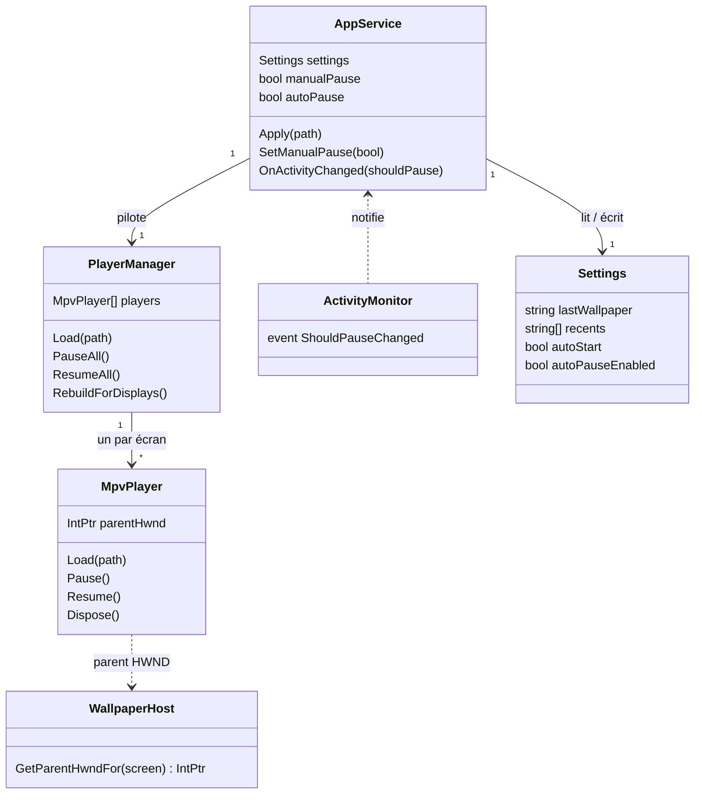
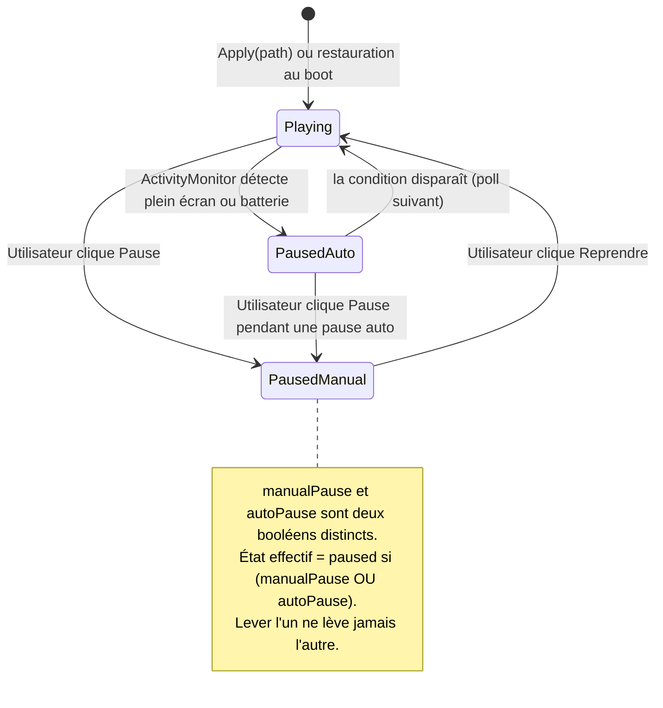
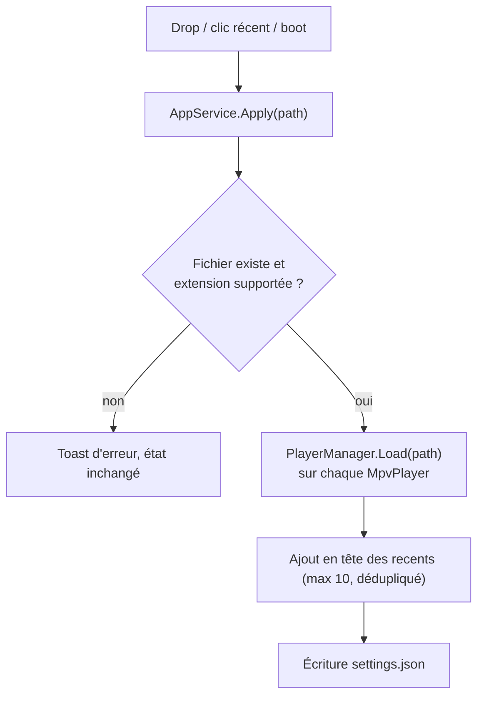

# Architecture technique — annexe

> **Niveau 2 / 2** — Annexe technique, destinée à un lecteur semi-technique (revue, futur développeur).
> Vue produit : [VUE-PRODUIT.md](./VUE-PRODUIT.md) · Glossaire : [../CONTEXT.md](../CONTEXT.md) ·
> Décisions produit : [../DESIGN.md](../DESIGN.md).
> Les diagrammes ci-dessous sont en **Mermaid** : ils s'affichent directement sur GitHub.
> _Généré au stade kickoff (2026-07-18), avant tout code — dérivé de DESIGN.md et du system design._
> **⚠️ Statut : spécification.** Les composants et champs cités sont ceux du design validé, pas des
> fichiers existants. Ce document doit être re-dérivé du code réel dès la première implémentation.
<!-- doc-provenance: commit=none generated=2026-07-18 stage=kickoff -->

## Stack

| Couche | Technologie | Emplacement prévu |
|--------|-------------|-------------------|
| Application | C# / .NET 8, WPF (projet unique) | `src/Wallflow/` |
| Lecture média | libmpv (`mpv-2.dll` embarquée), mode embedding `wid` | `MpvPlayer` |
| Intégration bureau | WinAPI via P/Invoke (WorkerW, foreground, power) | `WallpaperHost`, `ActivityMonitor` |
| UI tray | H.NotifyIcon (lib) | `TrayIcon` |
| Thème | WPF-UI ou équivalent Fluent sombre | `MainWindow` |
| Persistance | `System.Text.Json`, fichier unique | `%LOCALAPPDATA%\Wallflow\settings.json` |

Cibles : Windows 10/11, x64 uniquement. Distribution : zip portable (pas d'installeur).

## Modèle de domaine (non persisté, sauf `Settings`)

Pas de base de données. Le domaine est un graphe d'objets en mémoire ; seul `Settings` est
sérialisé sur disque.



Frontières (décision figée) : tout le WinAPI est confiné dans `WallpaperHost` + `ActivityMonitor`,
tout libmpv dans `MpvPlayer`. `AppService` et `PlayerManager` sont du .NET pur, testables sans
écran. Pas d'interfaces ni de DI : classes concrètes instanciées par `AppService`.

## Cycle de vie de la lecture

L'état de lecture est le produit de **deux drapeaux indépendants** (`manualPause`, `autoPause`) —
la lecture ne tourne que si les deux sont levés. C'est le point de design le plus piégeux : la fin
d'un jeu plein écran lève `autoPause` mais ne doit jamais lever une pause manuelle posée avant.



## Flux métier

### Appliquer un wallpaper

Déclencheurs : drop dans `MainWindow`, clic sur un élément des `Récents`, ou restauration au boot.



La validation d'entrée (existence du fichier, extension dans la liste supportée) est la seule
frontière de confiance du produit : tout le reste est local et mono-utilisateur.

### Démarrage (clé `Run`)

1. Windows lance `wallflow.exe` (clé `HKCU\...\Run`, écrite par l'app elle-même).
2. Mutex nommé single-instance : une deuxième instance active la fenêtre de la première et quitte.
3. L'app **réécrit sa clé `Run` avec son chemin courant à chaque lancement** — c'est ce qui rend le
   zip portable déplaçable sans casser l'auto-start (décision DESIGN.md).
4. Démarrage dans le tray, sans fenêtre ; si `lastWallpaper` existe encore sur disque → `Apply`.

### Reconstruction multi-écran

`SystemEvents.DisplaySettingsChanged` → `PlayerManager.RebuildForDisplays()` : dispose tous les
`MpvPlayer`, ré-énumère les écrans, recrée un player par écran, ré-applique le wallpaper courant.
Brutal mais simple ; un changement d'écran est un événement rare.

## Intégration bureau (WorkerW)

Le point non standard du projet. `WallpaperHost` envoie `SendMessage(Progman, 0x052C)` pour que le
shell crée la fenêtre WorkerW entre le fond d'écran natif et les icônes, puis y insère une fenêtre
enfant par écran, dimensionnée aux bounds du monitor. Chaque `MpvPlayer` reçoit ce HWND via
l'option mpv `wid` (mpv rend directement dedans — pas de render API, pas d'OpenGL côté app).

> ⚠️ Technique non documentée par Microsoft : peut casser sur une mise à jour de Windows.
> Référence d'implémentation : le code source de Lively Wallpaper.

Options mpv figées au lancement (défauts sans réglages, décision DESIGN.md) :
`loop=inf`, `mute=yes`, `panscan=1.0` (cover), `hwdec=auto`.

## Surveillance d'activité

| Tâche | Déclencheur | Planning | Effet |
|-------|-------------|----------|-------|
| Détection plein écran | `DispatcherTimer` dans `ActivityMonitor` | toutes les 2 s | `GetForegroundWindow` + comparaison de ses bounds à ceux du monitor → `autoPause` |
| Détection batterie | même timer | toutes les 2 s | `PowerLineStatus` / économie d'énergie → `autoPause` |

Polling assumé (`ponytail`) : des hooks WinEvent remplaceront le timer si le poll devient visible
en consommation, ce qui est improbable à 0,5 Hz.

## Persistance

Un seul fichier, `%LOCALAPPDATA%\Wallflow\settings.json`, réécrit en entier à chaque changement :

```json
{
  "lastWallpaper": "C:\\Users\\...\\ocean.mp4",
  "recents": ["...max 10 chemins, plus récent en tête..."],
  "autoStart": true,
  "autoPauseEnabled": true
}
```

Pas à côté de l'exe : le dossier portable peut être déplacé ou en lecture seule — LOCALAPPDATA
survit aux deux. Les `recents` stockent des **chemins**, pas des copies : un fichier supprimé par
l'utilisateur disparaît de la grille au chargement suivant (vignette introuvable → entrée purgée).

## Vignettes des récents

Aucun code de génération : l'API shell Windows (`IShellItemImageFactory`) fournit des miniatures
pour tous les formats supportés (c'est elle que l'Explorateur utilise). Appel par chemin, cache
géré par l'OS.

## Intégrations externes

| Dépendance | Usage | Nature |
|-----------|-------|--------|
| libmpv (`mpv-2.dll`) | décodage + rendu de tous les formats | binaire natif embarqué (~50-70 Mo, poids assumé) |
| H.NotifyIcon | icône et menu de la zone de notification | package NuGet |
| WPF-UI (ou équivalent) | thème Fluent sombre | package NuGet |

Aucun service réseau : pas de télémétrie, pas de mise à jour automatique, rien ne sort de la machine.
