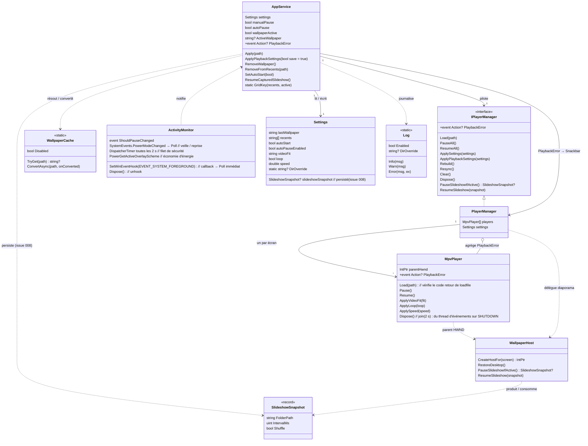
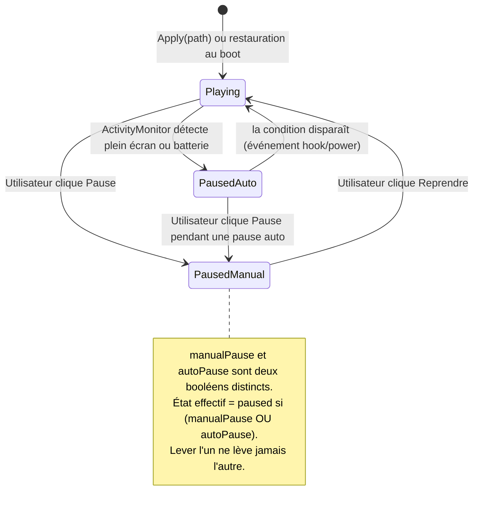
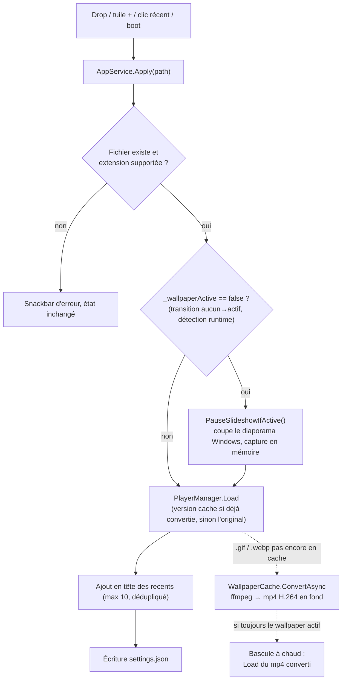
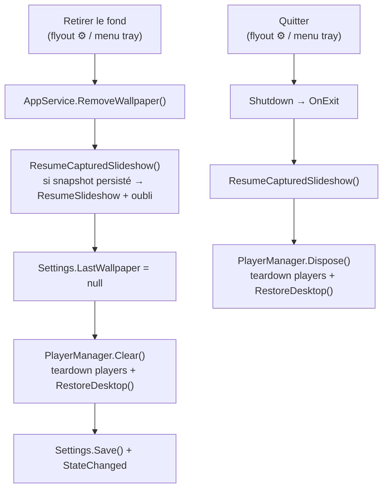
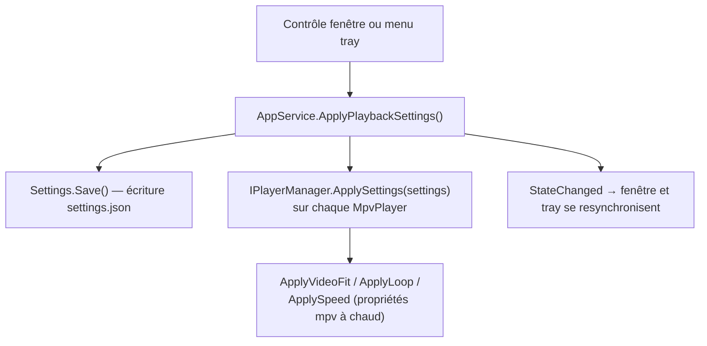

# Architecture technique — annexe

> **Niveau 2 / 2** — Annexe technique, destinée à un lecteur semi-technique (revue, futur développeur).
> Vue produit : [VUE-PRODUIT.md](./VUE-PRODUIT.md) · Glossaire : [../CONTEXT.md](../CONTEXT.md) ·
> Décisions produit : [../DESIGN.md](../DESIGN.md).
> Les diagrammes ci-dessous sont en **Mermaid** : ils s'affichent directement sur GitHub.
> _Généré au commit `f897b4a` (2026-08-12, + arbre de travail modifié)._
<!-- doc-provenance: commit=f897b4a generated=2026-08-12 -->

## Stack

| Couche | Technologie | Emplacement |
|--------|-------------|-------------|
| Application | C# / .NET 8 WPF, TFM `net8.0-windows10.0.19041.0` (min. 17763), x64 | `src/Wallflow/` |
| Lecture média | libmpv (`libmpv-2.dll`, build shinchiro, dans `lib/` hors git), embedding `wid` | `MpvPlayer.cs` |
| Intégration bureau | WinAPI via P/Invoke (WorkerW, foreground, power) | `WallpaperHost.cs`, `ActivityMonitor.cs` |
| UI tray | H.NotifyIcon.Wpf 2.3.0 : icône lecture/pause dessinée en mémoire (GDI+, base `Icon.ExtractAssociatedIcon` + badge), tooltip = wallpaper actif, thème natif Fluent/Dark intouché, efficiency mode off | `App.xaml.cs` (`BuildTray`, `BuildStateIcon`) |
| Fenêtre | WPF-UI 4.3.0 : `FluentWindow` backdrop `None`, habillage **Vermillon** (palette crème/encre/vermillon, ombres dures, coins carrés, titres en `Shippori Mincho` embarquée) scopé à `MainWindow.Resources` — le thème `ui:ThemesDictionary Theme="Dark"` reste global (App.xaml) pour que le tray natif ne soit pas affecté ; redimensionnable, grille des `Récents` en héros, barre du bas à 2 contrôles (Play/Pause, `Flyout` réglages), `SnackbarPresenter` pour les erreurs, icônes `SymbolIcon` (Segoe Fluent) | `MainWindow.xaml(.cs)`, `src/Wallflow/Resources/Vermillon.xaml` |
| Vignettes | API shell `IShellItemImageFactory`, décodage **asynchrone** (thread pool + Dispatcher) | `Thumbnail.cs`, `MainWindow.BuildThumb` |
| Conversion perf | ffmpeg.exe embarqué (build ≥ 7.1 requis pour le webp animé, `lib/` hors git comme libmpv) : GIF/webp → mp4 H.264 en cache pour récupérer le décodage matériel | `WallpaperCache.cs` |
| Persistance | `System.Text.Json`, écriture atomique (tmp + `File.Move` overwrite) | `%LOCALAPPDATA%\Wallflow\settings.json` |
| Journalisation | `Log.cs` : fichier texte rotatif par jour (append verrouillé, ne jette jamais) | `%LOCALAPPDATA%\Wallflow\logs\wallflow-YYYYMMDD.log` |
| Tests | xunit, mock manuel de `IPlayerManager` ; **parallélisation désactivée** (statiques d'isolation globales au process) ; isolation du réel via `TestIsolation` : `Settings.DirOverride` (settings.json), `AppService.SkipRunKey` (clé registre `Run`), `WallpaperCache.Disabled` (pas de spawn ffmpeg), `Log.Enabled`, `ActivityMonitor.Disabled` ; **garde structurelle** au chargement de l'assemblage de test (`TestAssemblyState` module initializer) — le vrai log/settings/clé Run ne sont jamais touchés, même si un test oublie `TestIsolation` | `tests/Wallflow.Tests/` |

Formats acceptés (`AppService.SupportedExtensions`) : `.gif .webp .mp4 .webm .mkv .png .jpg .jpeg .bmp`
— `.mkv` s'est ajouté au design initial (gratuit via mpv).

Cibles : Windows 10/11, x64 uniquement. Distribution : zip portable (pas d'installeur).
Vérification manuelle des comportements live-only (diaporama, veille, économie d'énergie, erreurs
mpv) : [TEST-MANUEL.md](./TEST-MANUEL.md).

## Habillage Vermillon de la fenêtre

`src/Wallflow/Resources/Vermillon.xaml` (nouveau `ResourceDictionary`) redéfinit les clés de
brush/couleur WPF-UI (`ApplicationBackgroundBrush`, `ButtonBackground*`, `ToggleSwitch*`,
`FlyoutBackground`, `ContextMenuBackground`…) avec la palette Vermillon (tokens extraits dans
[docs/design/vermillon-tokens.md](design/vermillon-tokens.md)). Il est mergé dans
`MainWindow.Resources`, **pas** `App.Resources` : la résolution `DynamicResource` remonte l'arbre
visuel et trouve ces overrides avant d'atteindre `Application`, donc seule `MainWindow` en hérite —
`App.xaml` garde `ui:ThemesDictionary Theme="Dark"` global, ce qui laisse le menu contextuel natif
du tray (construit dans `App.xaml.cs`, hors de l'arbre visuel de `MainWindow`) inchangé. Décision
délibérée : merger les overrides dans `App.Resources` aurait reskinné le tray aussi.

Corollaires visuels : `WindowBackdropType="None"` (remplace `Mica`, incompatible avec un fond
opaque crème), coins carrés forcés par un `Style` `CornerRadius="0"` sur `ui:Button` (scopé à
`MainWindow.Resources`), ombres portées dures via un `DropShadowEffect` `BlurRadius="0"`. Titres en
`Shippori Mincho` (police réelle embarquée en `Resource` MSBuild, `src/Wallflow/Fonts/`, référencée
par fragment `./Fonts/#Shippori Mincho` — pas de fallback système si le fichier manque).

## Modèle de domaine (non persisté, sauf `Settings`)

Pas de base de données. Le domaine est un graphe d'objets en mémoire ; seul `Settings` est
sérialisé sur disque.



Frontières (décision figée) : tout le WinAPI **et le COM `IDesktopWallpaper`** (diaporama natif) sont
confinés dans `WallpaperHost` + `ActivityMonitor`, tout libmpv dans `MpvPlayer`. `AppService` et
`PlayerManager` sont du .NET pur, testables sans écran — l'orchestration du diaporama vit dans
`AppService` (transitions), pas dans le code COM ; `PlayerManager` ne fait que déléguer à
`WallpaperHost`. Un seul seam de DI : `AppService` reçoit un `IPlayerManager` (interface extraite pour les
tests, mock dans `tests/Wallflow.Tests/`) ; le reste est instancié en concret.

## Cycle de vie de la lecture

L'état de lecture est le produit de **deux drapeaux indépendants** (`manualPause`, `autoPause`) —
la lecture ne tourne que si les deux sont levés. C'est le point de design le plus piégeux : la fin
d'un jeu plein écran lève `autoPause` mais ne doit jamais lever une pause manuelle posée avant.



## Flux métier

### Appliquer un wallpaper

Déclencheurs : drop n'importe où sur `MainWindow` (voile plein cadre pendant le glisser), tuile
« + » ou dialogue Parcourir, clic sur un élément des `Récents`, ou restauration au boot.



La conversion (`WallpaperCache`, clé de cache = chemin + taille + date dans
`%LOCALAPPDATA%\Wallflow\cache`) existe pour la perf : le décodage GIF/webp de mpv est 100 % CPU
(webp 17 Mo mesuré à 27,5 % sur la machine de référence), le mp4 converti se décode en matériel
(~1 % à cache chaud). L'original joue pendant la conversion (~20-30 s) ; les `recents` et
`settings.json` gardent toujours le **chemin d'origine**. Sans `ffmpeg.exe` ou sur échec ffmpeg,
l'original joue tel quel — le cache est une optimisation, jamais un point de défaillance. Le test
« toujours actif » se fait dans le lambda dispatché sur le thread UI (un Apply intercalé ne doit
pas être écrasé par une conversion périmée). Pas d'éviction du cache (borné de fait par les
10 récents).

La validation d'entrée (existence du fichier, extension dans la liste supportée) est la seule
frontière de confiance du produit : tout le reste est local et mono-utilisateur.

Une erreur de lecture détectée en cours de route (propriété mpv `playback-error` ou code retour de
`loadfile` ≠ 0) remonte jusqu'à la Snackbar via `IPlayerManager.PlaybackError`. L'état en mémoire
reste cohérent : l'erreur ne change ni les `Récents` ni le `LastWallpaper`.

### Retirer le fond d'écran / Quitter (Restauration du bureau)

Détruire les fenêtres hôtes ne fait **pas** réapparaître le fond natif : Windows laisse le bureau
blanc. La primitive `WallpaperHost.RestoreDesktop()` corrige ça —
`SystemParametersInfo(SPI_SETDESKWALLPAPER, 0, null, SPIF_UPDATEINIFILE | SPIF_SENDCHANGE)` demande
au shell de repeindre le fond enregistré.



État « retiré » = **absence de wallpaper courant**, exprimée par `LastWallpaper == null` (décision B :
aucun drapeau dédié). Le garde de démarrage existant (`si LastWallpaper existe & fichier présent →
Apply`) rend la persistance gratuite : après un retrait, rien n'est réappliqué au boot suivant.
`Rebuild()` (écran branché/débranché) ne restaure **pas** — il re-couvre immédiatement, éviter le
flicker.

### Retirer des récents / marquage du wallpaper actif

Deux ajouts au cœur, confinés à `AppService`, sans nouvel état :

- `ActiveWallpaper` est une **propriété dérivée** (`=> Settings.LastWallpaper`) : la grille marque
  d'un badge la vignette dont le chemin correspond (comparaison `OrdinalIgnoreCase`). Elle devient
  `null` après `RemoveWallpaper`.
- `RemoveFromRecents(path)` ôte l'entrée de `Settings.Recents`, sauvegarde et notifie `StateChanged`.
  Elle **ne touche ni les players ni le wallpaper courant** — retirer la vignette de l'actif ne
  déclenche donc jamais un `RemoveWallpaper` : le fond continue de jouer, il n'est plus dans la
  grille. C'est le comportement couvert par `AppServiceTests` (retrait + persistance + notification +
  non-interférence).

Le menu contextuel des vignettes (`MainWindow.BuildRecentMenu`) expose « Retirer des récents » et
« Ouvrir l'emplacement du fichier » (`explorer /select`) ; la tuile « + » n'a pas de menu.

### Démarrage (clé `Run` + tâche planifiée de réveil)

1. Windows lance `wallflow.exe` (clé `HKCU\...\Run`, écrite par l'app elle-même).
2. Mutex nommé single-instance : une deuxième instance active la fenêtre de la première et quitte —
   sauf si l'argument `--wake-relaunch` est présent (point 5), auquel cas elle quitte silencieusement
   sans réveiller la fenêtre.
3. L'app **réécrit sa clé `Run` avec son chemin courant à chaque lancement** — c'est ce qui rend le
   zip portable déplaçable sans casser l'auto-start (décision DESIGN.md).
4. Démarrage dans le tray, sans fenêtre ; si `lastWallpaper` existe encore sur disque → `Apply`.
5. **Tâche planifiée de réveil** (`AppService.BuildWakeTaskArgs` / `WriteWakeTask`, appelée par
   `WriteRunKey` à chaque lancement) : la clé `Run` ne se rejoue qu'à l'ouverture de session — si
   Windows a tué le process pendant une veille prolongée, rien ne le relance avant le prochain
   login. Une tâche `schtasks` comble ce trou :

   | Tâche planifiée | Déclencheur | Action | Portée |
   |---|---|---|---|
   | `Wallflow_WakeRelaunch` | Event log `System`, `Microsoft-Windows-Power-Troubleshooter` EventID=1 (sortie de veille / veille prolongée) | `wallflow.exe --tray --wake-relaunch` | créée/retirée avec `Settings.AutoStart` (même toggle que la clé `Run`) ; utilisateur courant, sans élévation |

   Best-effort (même tolérance que `ActivityMonitor.Poll`) : un échec de `schtasks` (absent, droits)
   est simplement loggé (`Log.Warn`), jamais bloquant pour le démarrage. Grâce au mutex
   single-instance, si l'app tournait déjà au réveil, ce lancement automatique se contente de
   sortir (`--wake-relaunch` court-circuite le réveil de fenêtre du point 2) — seul le cas où le
   process avait réellement disparu aboutit à un vrai relancement.

### Appliquer un réglage de lecture

Déclencheurs : le flyout ⚙ de la barre du bas de `MainWindow` (radios cadrage, toggle boucle,
**4 radios de vitesse** `0.5× · 1× · 1.5× · 2×`, toggle démarrage Windows). Le son est retiré du
produit (écart DESIGN.md du 2026-08-10) : aucun contrôle de volume, ni fenêtre ni tray — `mpv`
reste codé en dur en muet (`MpvPlayer` constructeur, `SetOption("mute", "yes")`).

La vitesse s'affiche par **paliers nommés** (helper pur `SpeedPaliers`, valeurs `[0.5, 1.0, 1.5,
2.0]`). Au refresh, la fenêtre met en évidence `SpeedPaliers.Nearest(Settings.Speed)` **sans**
réécrire `Settings.Speed` tant que l'Utilisateur ne clique pas (garde `_refreshing`) — une valeur
enregistrée hors palier (ex. `3.0`) n'est pas silencieusement écrasée. Le backend `Settings.Speed`
reste continu (clamp `0.25–4.0`) : seul l'affichage se restreint aux paliers.



`PlayerManager` mémorise les derniers `Settings` reçus et les **réapplique à chaque `Load`** :
les players fraîchement créés (démarrage, `Rebuild`) partent des défauts figés du constructeur
`MpvPlayer`, pas de `settings.json`. `AppService` pousse les settings au manager dès sa
construction. Les valeurs hors limites sont clampées dans les setters de `Settings`
(vitesse 0.25-4.0, cadrage restreint à cover/fit/fill).

### Icône et info-bulle du tray

Point d'accroche unique : le `Sync()` local de `App.BuildTray()`, déjà appelé sur chaque
`_service.StateChanged`. Deux diffs gardés en mémoire (`_lastTrayPaused`, `_lastTrayTooltip`)
évitent de reconstruire l'icône/tooltip sur un `StateChanged` qui ne change ni l'un ni l'autre
(ex. changement de vitesse).

- **Icône lecture/pause** : badge dessiné à l'exécution par-dessus l'icône de l'exe
  (`BuildStateIcon`, `System.Drawing.Graphics.DrawIcon` + `Bitmap.GetHicon` + `Icon.FromHandle`) —
  aucun `.ico` à committer. `Icon.FromHandle` ne prend pas possession du HICON source (doc MS) :
  `DestroyIcon` (P/Invoke `user32.dll`) est appelé explicitement juste après l'assignation à
  `tray.Icon`, sinon chaque toggle fuit un handle GDI (recherche complète :
  [docs/research/tray-icon-state-tooltip.md](research/tray-icon-state-tooltip.md)).
- **Tooltip** : `Path.GetFileName(ActiveWallpaper)`, tronqué à 127 caractères (limite dure
  `NOTIFYICONDATAW.szTip`), ou `"Wallflow"` si aucun wallpaper actif.
- Le menu contextuel du tray (natif, non affecté par l'habillage Vermillon ci-dessus) gagne un
  séparateur avant `Quitter`.

### Reconstruction multi-écran

`SystemEvents.DisplaySettingsChanged` → `PlayerManager.Rebuild()` : dispose tous les
`MpvPlayer`, ré-énumère les écrans, recrée un player par écran, ré-applique le wallpaper courant
et les réglages de lecture. Brutal mais simple ; un changement d'écran est un événement rare.

> ⚠️ **Garde anti-boucle obligatoire** : recréer un player mpv (contexte D3D11 dans le WorkerW)
> émet lui-même un `DisplaySettingsChanged` — sans garde, Rebuild s'auto-alimentait à ~33 Hz
> (mp4 mesuré à 43 % CPU, retombé à ~7 % après correction). `Rebuild` compare donc une signature
> de la config réelle (`ScreenSig()` : bounds de `Screen.AllScreens`) et ne reconstruit que si
> elle a changé.

La **reprise de veille** (`SystemEvents.PowerModeChanged` = `Resume`) ne re-enumère pas les écrans
et ne détruit plus le contexte mpv : `IPlayerManager.ResyncLight()` rejoue le wallpaper courant sur
place en gardant le contexte mpv et le host Win32 vivants (simple `Load()`), sans passer par la
garde `ScreenSig` ni par le teardown complet de `Resync()`. Un vrai changement d'écrans (nombre de
`Entry`/HWND qui change) continue de passer par `Rebuild()` → `Resync()`, seul cas qui a besoin de
détruire/recréer les hosts. Les événements `SystemEvents` arrivent sur un thread de pool :
`AppService` les marshale vers le `Dispatcher` (`OnUiThread`, no-op si aucune `Application`) avant
de toucher aux players — pas de race sur le WorkerW entre un hook système et la boucle UI.

## Intégration bureau (WorkerW)

Le point non standard du projet. `WallpaperHost` envoie `SendMessage(Progman, 0x052C)` pour que le
shell crée la fenêtre WorkerW entre le fond d'écran natif et les icônes, puis y insère une fenêtre
enfant par écran, dimensionnée aux bounds du monitor. Chaque `MpvPlayer` reçoit ce HWND via
l'option mpv `wid` (mpv rend directement dedans — pas de render API, pas d'OpenGL côté app).

> ⚠️ Technique non documentée par Microsoft : peut casser sur une mise à jour de Windows.
> Référence d'implémentation : le code source de Lively Wallpaper.

Le shell peut recréer le WorkerW en cours de session (coupe/reprise du diaporama via
`IDesktopWallpaper`, ou `RestoreDesktop()` après un `Retirer le fond d'écran` — `SPI_SETDESKWALLPAPER`
fait réémettre le WorkerW par Explorer) : le HWND capturé par `Init()` devient alors périmé. Piège
constaté en usage réel : un handle périmé reste souvent un HWND *valide* auquel `CreateWindowEx`
réussit quand même (la fenêtre existe encore, juste plus composée à l'écran) — pas d'erreur Win32 à
détecter, donc `mpv` échoue ensuite silencieusement à s'attacher au host (`vo: unable to create
window`), écran noir permanent. `WallpaperHost.CreateHostFor` relocalise donc le WorkerW (`Init()`)
à **chaque** appel, plutôt que seulement en réaction à un échec explicite de `CreateWindowEx`.

Options mpv posées au constructeur (défauts sûrs, écrasés ensuite par `ApplySettings`) :
`loop-file=inf`, `mute=yes`, `panscan=1.0` (cover), `hwdec=auto`. Deux subtilités relevées en
code-review : mpv n'a **pas** de propriété `video-fit` — le cadrage se pilote via
`panscan` + `keepaspect` (cover = panscan 1 ; fit = panscan 0 ; fill = keepaspect no) — et la
vitesse est formatée en `CultureInfo.InvariantCulture` (en fr-FR, `1,50` serait rejeté par mpv).

`MpvPlayer` fait tourner une boucle d'événements mpv (`mpv_wait_event`, thread `mpv-events` en
arrière-plan) pour observer la propriété `playback-error` et, via `mpv_request_log_messages`, les
messages internes `error`/`fatal` (ex. échec `vo` ci-dessus) — sinon totalement silencieux côté
`mpv_wait_event`, relayés dans nos logs (`Log.Warn`). `Load` vérifie le code retour de
`loadfile` ; une erreur remonte `PlaybackError` → `PlayerManager` (agrégé) → `AppService` →
`MainWindow` (Snackbar via `Dispatcher.BeginInvoke`) — un fichier corrompu ou injouable est donc
visible par l'Utilisateur au lieu d'un écran figé silencieux. `Dispose` envoie la commande
`quit` **avant** `mpv_terminate_destroy`, pour laisser la boucle d'événements recevoir `SHUTDOWN`
et sortir d'elle-même en premier (`join` réussit alors immédiatement) : appeler
`mpv_terminate_destroy` (qui libère le contexte en interne) pendant que ce thread lit encore le
même contexte est une race UB documentée côté mpv — elle empêchait `SHUTDOWN` d'être vu
proprement, faisait systématiquement expirer le `join(2 s)` et laissait un thread orphelin à
chaque Resync/relance (fond blanc de plusieurs secondes à la reprise d'une vidéo). Un résidu
~600-700ms subsistait après ce fix : la recompilation du pipeline de shaders `gpu-next` à chaque
contexte mpv recréé (~400ms mesurés). `ResyncLight` (ci-dessus) l'évite sur le chemin resume en
gardant le contexte vivant — fenêtre `loadfile`→première frame ramenée à ~290-337ms.

## Anti-flicker : coupure du diaporama Windows natif

Quand le fond natif de Windows est réglé en **`Diaporama Windows`**, son tick périodique repeint
l'écran en plein cadre à chaque changement d'image — par-dessus le `Wallpaper` de Wallflow, d'où un
flicker au rythme de l'intervalle configuré. Aucune notification système n'annonce ce repaint
(4 pistes testées et écartées, cf. PRD) : la stratégie est donc de **supprimer la cause** — couper le
diaporama tant qu'un `Wallpaper` est actif, le restaurer ensuite.

Deux couches, séparation nette :

- **Primitive COM** dans `WallpaperHost` (même frontière que le WorkerW, live-only, non testable
  unitairement) via `IDesktopWallpaper` (`CLSID_DesktopWallpaper`, dispo Windows 8+) :
  - `PauseSlideshowIfActive()` : capture best-effort (`GetSlideshow` → dossier via
    `IShellItem::GetDisplayName`, `GetSlideshowOptions` → intervalle + mélange) dans un
    `SlideshowSnapshot`, puis coupe le défilement — **la coupure (`Enable(false)`) est tentée même si
    la capture échoue** : l'objectif premier est de stopper le flicker, pas de capturer.
  - `ResumeSlideshow(snapshot)` : `SHCreateItemFromParsingName` + `SHCreateShellItemArrayFromShellItem`
    → `SetSlideshow` + `SetSlideshowOptions` + `Enable(true)`.
- **Orchestration** dans `AppService` (testable via le seam `IPlayerManager`) : capture à la
  **transition détectée par un drapeau runtime `_wallpaperActive`** (un changement d'image d'un
  `Wallpaper` déjà actif ne recapture pas ; `Rebuild` non plus). Le drapeau vit en mémoire, jamais
  persisté — contrairement à `Settings.LastWallpaper`, qui reste non-null après un crash/relance :
  détecter la transition sur `LastWallpaper == null` aurait manqué la recapture au démarrage (la
  restauration retrouve un `LastWallpaper` déjà renseigné alors qu'aucun `Wallpaper` n'est encore
  affiché dans ce process — sinon le diaporama, relancé par le `Shutdown` précédent, n'était jamais
  recoupé). `RemoveWallpaper()` et `Shutdown()` appellent `ResumeCapturedSlideshow()` (restaure puis
  oublie). Le snapshot vit dans `Settings.SlideshowSnapshot`, **persisté dans settings.json**
  (issue 008, commit `3dbc384`) : après un crash, il survit et le diaporama est restauré au prochain
  `Retirer le fond d'écran` ou `Quitter` — plus de config de diaporama perdue.

> ⚠️ **Écarts réel vs intention (vérifiés live, Win10 19045)** — le PRD prévoyait de couper via
> l'effet de bord de `SetWallpaper(image courante)` et de détecter via `GetStatus() == DSS_ENABLED`.
> Les deux se sont révélés faux en programmatique : `SetWallpaper` **ne coupe pas** le diaporama
> (et `GetWallpaper(null)` renvoie vide pendant un diaporama), et `GetStatus` ne reporte
> `DSS_SLIDESHOW` que lorsqu'il est posé par l'app Réglages (reste `DSS_ENABLED` après tout appel COM).
> Signaux fiables retenus : détection par le registre `BackgroundType == 2`
> (`…\Explorer\Wallpapers`), coupure/reprise par `Enable(false)`/`Enable(true)` — round-trip vérifié
> `0x3 → 0x0 → 0x3`, `RestoreDesktop()` (SPI_SETDESKWALLPAPER) sur le chemin de sortie **ne clobbe
> pas** le diaporama relancé (les deux couches sont bien indépendantes).

## Surveillance d'activité

| Tâche | Déclencheur | Planning | Effet |
|-------|-------------|----------|-------|
| Détection plein écran | `SetWinEventHook(EVENT_SYSTEM_FOREGROUND)` (callback → `Poll()` immédiat) | immédiat | `GetForegroundWindow` + comparaison de ses bounds à ceux du monitor → `autoPause` |
| Détection batterie | `SystemEvents.PowerModeChanged` | immédiat | `PowerLineStatus` → `autoPause` |
| Économie d'énergie | idem + `Poll()` périodique | immédiat / 2 s | `PowerGetActiveOverlayScheme` == `GUID_BATTERY_SAVER_OVERLAY_SCHEME` → `autoPause` |
| Filet de sécurité | `DispatcherTimer` dans `ActivityMonitor` | toutes les 2 s | re-`Poll()` (le hook foreground ne couvre pas les changements de fenêtre au sein du même process) |

Déclenchement **événementiel** (hook WinEvent + notifications de power), le timer 2 s ne sert plus
que de filet — le premier `Poll` est aussi déclenché par le callback du hook. Hook posé via
`SetWinEventHook(WINEVENT_OUTOFCONTEXT)` (callback sur le thread UI du Dispatcher, pas de race sur
`GetForegroundWindow`) ; échec du hook → simple warn (best-effort, le timer prend le relais) ;
`Dispose()` décroche le hook. Le contrôle d'économie d'énergie (`PowerGetActiveOverlayScheme`,
best-effort) est distinct du `PowerLineStatus` : sur un PC **branché** en mode Économie d'énergie,
le wallpaper doit aussi se mettre en pause. `Poll` est **blindé** (try/catch) : il est appelé depuis
des callbacks système où une exception est fatale — un échec de détection ne doit jamais tuer l'app.

> ⚠️ `PowerGetActiveOverlayScheme` n'existe que sur **Windows 11** (build ≥ 22000). Sur **Windows 10**
> il lève `EntryPointNotFoundException` (crash réel 2026-08-03, `0xe0434352`) : détecté une fois puis
> court-circuité. Dégradation assumée : sur Win10 seule la pause batterie (`PowerLineStatus`) reste
> active ; l'économie d'énergie est détectée sur Win11.

## Persistance

Un seul fichier, `%LOCALAPPDATA%\Wallflow\settings.json`, réécrit en entier à chaque changement :

```json
{
  "LastWallpaper": "C:\\Users\\...\\ocean.mp4",
  "Recents": ["...max 10 chemins, plus récent en tête..."],
  "AutoStart": true,
  "AutoPauseEnabled": true,
  "VideoFit": "cover",
  "Loop": true,
  "Speed": 1.0
}
```

Pas à côté de l'exe : le dossier portable peut être déplacé ou en lecture seule — LOCALAPPDATA
survit aux deux. À côté du fichier vit `%LOCALAPPDATA%\Wallflow\cache\` (mp4 convertis par
`WallpaperCache`, nommés par hash, jamais purgés) et `%LOCALAPPDATA%\Wallflow\logs\` (journaux
rotatifs de `Log`). Écriture **atomique** : `settings.json.tmp` + `StreamWriter.Flush(true)` +
`File.Move(..., overwrite: true)` — une coupure de courant ne laisse jamais un JSON tronqué à la
place du dernier bon. Les `recents` stockent des **chemins**, pas des copies ; `Settings.Save()`
**purge** ceux qui ne pointent plus vers un fichier existant (`File.Exists`) — un fichier supprimé
par l'utilisateur disparaît de la grille *et* du JSON.

## Vignettes des récents

Aucun code de génération : l'API shell Windows (`IShellItemImageFactory`) fournit des miniatures
pour tous les formats supportés (c'est elle que l'Explorateur utilise). Appel par chemin, cache
géré par l'OS.

Deux protections de réactivité dans `MainWindow` :

- **Grille reconstruite seulement si nécessaire** (`RefreshGrid`) : clé = liste des récents +
  wallpaper actif ; un `StateChanged` de réglage (ex. changement de vitesse) ne redéclenche pas le
  décodage des vignettes.
- **Décodage asynchrone** (`BuildThumb`) : placeholder immédiat (nom du fichier), extraction
  shell sur le thread pool, remplacement via le `Dispatcher` à l'arrivée — l'ouverture de la
  fenêtre ne bloque plus sur les fichiers jamais miniaturisés par l'Explorateur (plusieurs
  centaines de ms chacun). Si la grille a été reconstruite entre-temps, le conteneur capturé est
  détaché : écrire dedans est un no-op. Échec de décodage : le placeholder reste.

## Intégrations externes

| Dépendance | Usage | Nature |
|-----------|-------|--------|
| libmpv (`mpv-2.dll`) | décodage + rendu de tous les formats | binaire natif embarqué (~50-70 Mo, poids assumé) |
| ffmpeg (`ffmpeg.exe`) | conversion unique GIF/webp → mp4 du cache perf (build ≥ 7.1 requis : décodage webp animé) | binaire natif embarqué (~145 Mo build BtbN GPL, poids assumé) |
| H.NotifyIcon | icône et menu de la zone de notification | package NuGet |
| WPF-UI (ou équivalent) | thème Fluent sombre | package NuGet |

Aucun service réseau : pas de télémétrie, pas de mise à jour automatique, rien ne sort de la machine.
