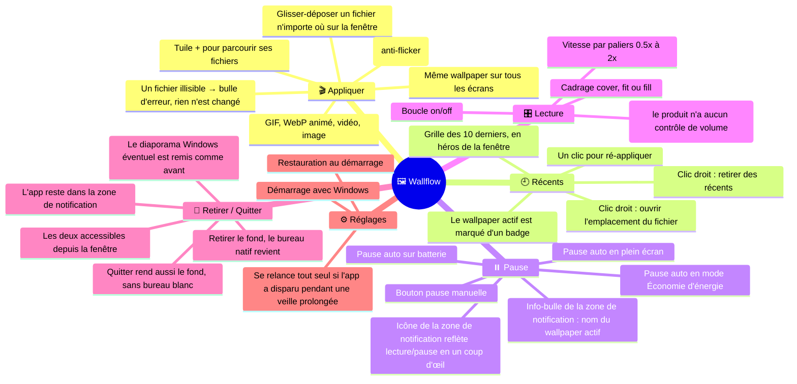
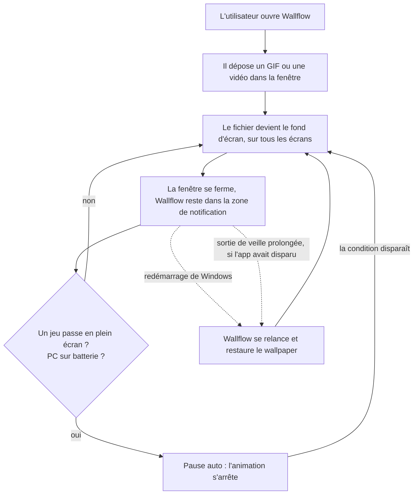
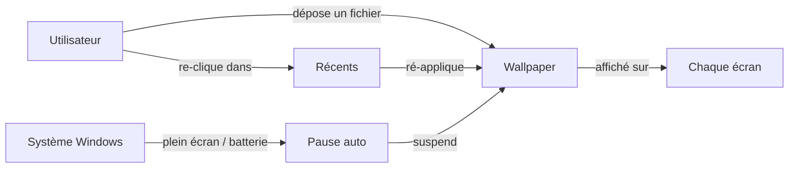
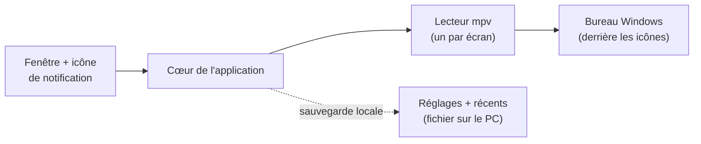

# Vue produit — Wallflow

> **Niveau 1 / 2** — Document de présentation, destiné à un lecteur non technique.
> Pour le détail d'implémentation, voir [ARCHITECTURE-TECHNIQUE.md](./ARCHITECTURE-TECHNIQUE.md).
> Le vocabulaire employé ici est défini dans [../CONTEXT.md](../CONTEXT.md).
> _Généré au commit `c40e340` (2026-08-17)._
<!-- doc-provenance: commit=c40e340 generated=2026-08-17 -->

## En une phrase

Wallflow permet à un **Utilisateur** Windows de transformer n'importe quel GIF, WebP animé, vidéo ou
image en **wallpaper** (fond d'écran) animé, d'un simple glisser-déposer — l'application vit dans la
zone de notification, se met en **pause auto** dès qu'un jeu passe en plein écran ou que le PC est
sur batterie, et restaure le wallpaper à chaque démarrage de Windows.

## Le rôle unique

| Rôle | Ce qu'il fait |
|------|---------------|
| **Utilisateur** | Dépose un fichier, obtient un fond d'écran animé. C'est tout. |

## Le parcours type

Le produit se vit en deux temps : une première utilisation de dix secondes, puis plus rien — il
travaille seul en arrière-plan.

1. Premier lancement : une fenêtre au style éditorial (fond crème, encre, accent vermillon,
   titres en serif), presque vide — la grille des récents ne contient qu'une tuile « + » avec
   l'invite « dépose un fichier ou clique ».
2. L'utilisateur glisse un fichier (n'importe où sur la fenêtre, un voile « Dépose pour appliquer »
   apparaît le temps du glisser) ou clique la tuile « + » pour le choisir — il est appliqué
   immédiatement (par défaut : en boucle et sans son, le produit n'a aucun contrôle de volume).
   Cadrage, boucle et vitesse se règlent depuis la barre du bas de la fenêtre ; le wallpaper qui
   joue est repérable d'un coup d'œil à son badge dans la grille, et sans même ouvrir la fenêtre à
   l'icône de la zone de notification (lecture/pause) et à son info-bulle (nom du wallpaper actif).
3. Wallflow s'efface dans la zone de notification ; l'utilisateur n'y repense plus.
4. Quand un jeu ou une vidéo passe en plein écran, que le portable passe sur batterie, ou que le
   mode Économie d'énergie s'active, l'animation se met en pause toute seule — zéro impact sur les
   performances ou l'autonomie.
5. Au redémarrage de Windows, le wallpaper revient sans aucune action ; même chose si l'application
   avait disparu pendant une longue mise en veille prolongée — elle se relance toute seule au réveil.
6. À tout moment, **Retirer le fond d'écran** (depuis la fenêtre ou la zone de notification) rend le
   bureau Windows d'origine tout en gardant l'application prête à ré-appliquer ; **Quitter** ferme
   l'application en restaurant lui aussi le fond — jamais de bureau blanc.

## Les concepts en relation

## L'architecture, en bref

Wallflow est une application de bureau autonome : pas de serveur, pas de compte, pas de connexion
internet. Elle glisse sa propre fenêtre d'affichage *derrière* les icônes du bureau — le fond
d'écran natif de Windows n'est jamais remplacé, seulement recouvert — et confie la lecture des
fichiers à mpv, un lecteur multimédia open source réputé, embarqué dans l'application. Quand on
retire le fond ou qu'on quitte, l'application redemande à Windows de repeindre ce fond natif, pour
qu'il réapparaisse intact.

Cas particulier : si le fond natif de Windows est réglé en **diaporama** (un dossier d'images qui
défilent), Wallflow le met en pause tant qu'un wallpaper est actif — sinon l'image du diaporama
réapparaîtrait brièvement à chaque changement, par-dessus l'animation (un clignotement gênant).
La pause **tient dans la durée** : si quelque chose relance le diaporama en cours de route (le
panneau Personnalisation de Windows, une autre application), Wallflow s'en aperçoit et le remet en
pause — le clignotement ne revient pas sans qu'on ait à redémarrer l'application.
Le diaporama est remis exactement comme il était — mêmes images, même intervalle — dès qu'on retire
le fond ou qu'on quitte.

Pour que l'animation ne pèse presque rien sur le PC, les GIF et WebP animés — coûteux à décoder —
sont convertis une seule fois, en arrière-plan, en vidéo légère : l'original s'affiche tout de
suite, la version économe prend le relais dès qu'elle est prête, et les fois suivantes elle démarre
directement. Rien ne change pour l'utilisateur : ses fichiers d'origine restent intacts et ce sont
eux qu'il voit dans les récents.

| Brique | Rôle |
|--------|------|
| Fenêtre + icône de notification | Le seul point de contact : déposer un fichier, revoir les récents, mettre en pause. |
| Cœur de l'application | Décide quoi jouer et quand se mettre en pause ; surveille plein écran et batterie. |
| Lecteur mpv | Décode et affiche tous les formats (GIF, WebP, vidéo, image), toujours sans son, selon les réglages de lecture (cadrage, boucle, vitesse). |
| Convertisseur | Transforme une fois pour toutes les GIF/WebP animés en vidéo économe, en arrière-plan — l'animation devient quasi invisible dans la consommation du PC. |
| Sauvegarde locale | Un petit fichier sur le PC : wallpaper courant, récents, réglages. Rien ne quitte la machine. |
