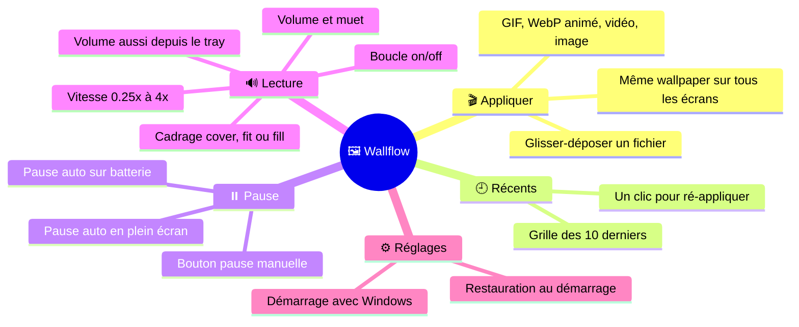
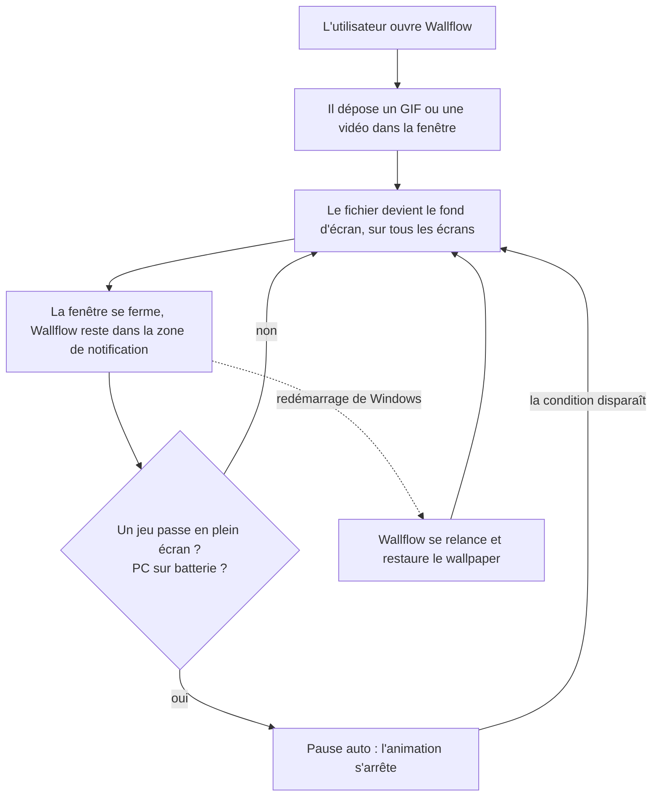
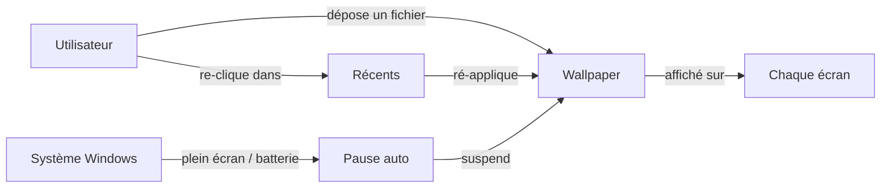
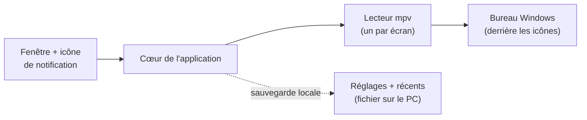

# Vue produit — Wallflow

> **Niveau 1 / 2** — Document de présentation, destiné à un lecteur non technique.
> Pour le détail d'implémentation, voir [ARCHITECTURE-TECHNIQUE.md](./ARCHITECTURE-TECHNIQUE.md).
> Le vocabulaire employé ici est défini dans [../CONTEXT.md](../CONTEXT.md).
> _Généré au commit `46b6b16` (2026-07-18)._
<!-- doc-provenance: commit=46b6b16 generated=2026-07-18 -->

## En une phrase

Wallflow permet à un **Utilisateur** Windows de transformer n'importe quel GIF, WebP animé, vidéo ou
image en **wallpaper** (fond d'écran) animé, d'un simple glisser-déposer — l'application vit dans la
zone de notification, se met en **pause auto** dès qu'un jeu passe en plein écran ou que le PC est
sur batterie, et restaure le wallpaper à chaque démarrage de Windows.

## Le rôle unique

| Rôle | Ce qu'il fait |
|------|---------------|
| **Utilisateur** | Dépose un fichier, obtient un fond d'écran animé. C'est tout. |

## Le parcours type

Le produit se vit en deux temps : une première utilisation de dix secondes, puis plus rien — il
travaille seul en arrière-plan.

1. Premier lancement : une petite fenêtre sombre avec une zone « dépose ton fichier ».
2. L'utilisateur glisse un fichier — il est appliqué immédiatement (par défaut : en boucle et sans
   son ; volume, cadrage, boucle et vitesse se règlent depuis la fenêtre, le volume aussi depuis la
   zone de notification).
3. Wallflow s'efface dans la zone de notification ; l'utilisateur n'y repense plus.
4. Quand un jeu ou une vidéo passe en plein écran, ou que le portable passe sur batterie,
   l'animation se met en pause toute seule — zéro impact sur les performances ou l'autonomie.
5. Au redémarrage de Windows, le wallpaper revient sans aucune action.

## Les concepts en relation

## L'architecture, en bref

Wallflow est une application de bureau autonome : pas de serveur, pas de compte, pas de connexion
internet. Elle glisse sa propre fenêtre d'affichage *derrière* les icônes du bureau — le fond
d'écran natif de Windows n'est pas modifié — et confie la lecture des fichiers à mpv, un lecteur
multimédia open source réputé, embarqué dans l'application.

| Brique | Rôle |
|--------|------|
| Fenêtre + icône de notification | Le seul point de contact : déposer un fichier, revoir les récents, mettre en pause. |
| Cœur de l'application | Décide quoi jouer et quand se mettre en pause ; surveille plein écran et batterie. |
| Lecteur mpv | Décode et affiche tous les formats (GIF, WebP, vidéo, image), selon les réglages de lecture (volume, cadrage, boucle, vitesse). |
| Sauvegarde locale | Un petit fichier sur le PC : wallpaper courant, récents, réglages. Rien ne quitte la machine. |
